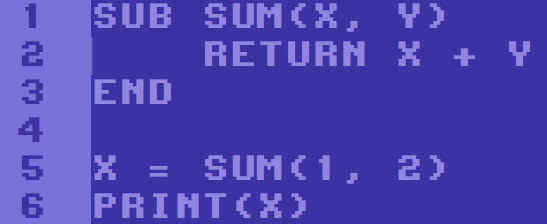

# Minstral BASIC

Minstral BASIC (MB) is an enhanced BASIC compiler for [Minstral VM](https://github.com/kinderjosh/minstral-vm). It makes writing Minstral VM programs quick and effortless due to its simple syntax and ease of use. It's influenced by [Commodore BASIC](https://en.wikipedia.org/wiki/Commodore_BASIC), giving it a vintage feel.

## Installation

Firstly, make sure you have the following dependencies installed:

- gcc
- make
- [mas (Minstral VM and Assembler)](https://github.com/kinderjosh/minstral-vm)

Then run the makefile as root:

```console
$ git clone https://github.com/kinderjosh/minstral-basic.git
$ cd minstral-basic
$ sudo make install
```

## Usage

```
mbc <command> [options] <input file>
```

### Commands

| Name | Description |
| --- | --- |
| asm | Produce an assembly file. |
| build | Produce a binary file. |
| ir | Produce an IR file. |
| run | Produce and execute a binary file. |

### Options

| Name | Description |
| --- | --- |
| -o ```<output file>``` | Specify the output filename.
| -unopt | Disable optimization. |

### Dev Options

These options are experimental and should only be used by MB developers.

| Name | Description |
| --- | --- |
| -freestanding | Don't use the standard library. |
| -nops | Shows NOPs in IR output. |
| -no-omit-libs | Don't omit library code when assembling. |

### Example

Try the preview code by running these commands:

```console
$ mbc build -o sum examples/sum.mb
$ mas exe ./sum
```

This converts the BASIC file into a format that can be run with Minstral VM.

Alternatively, you can quickly execute these commands at once with the ```run``` command:

```console
$ mbc run examples/sum.mb
```

## Syntax Highlighting

Syntax highlighting is available for VSCode in the [editor](./editor/) directory in the form of a VSIX file.

## Documentation

Wiki in progress.

## License

Minstral BASIC is distributed under the [BSD 3-Clause](./LICENSE) license.